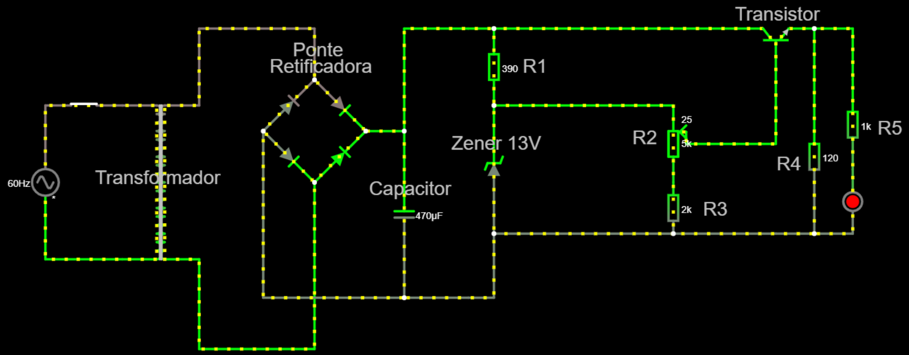

# SSC0180_2020_Fonte_Tensao
Projeto de estudo e desenvolvimento de uma fonte elétrica na matéria de SSC0180 USP 2020. Vamos partir da tensão da tomada (220V ou 110V) e teremos que transforma-la de 110V/220V Corrente Alternada em uma tensão adequada para alimentar nosso circuito. Isto é, de 3V-12V em Corrente Contínua.

## Diagrama da Fonte

* Tensão ajustável entre 3V e 12V
* Corrente de 100mA
* Baixo Custo

### Componentes e seus Valores
| Componente | Especificações | Valor |
| :---              |     :---:      |          :---  |
| Resistor          | 50Ω                 | R$            |
| Resistor          | 120Ω                 | R$            |
| Resistor          | 2kΩ                 | R$            |
| Potenciômetro     | 5kΩ                 | R$            |
| Capacitor         | 470μF               | R$            |
|Transistor         | 15V  e 500mA        | R$            |
| Diodo de Zener    | 0,5W                | R$            |
| Ponte Retificadora| 15V e 2A            | R$            |
| Transformador     | 15V e 500mA         | R$            |
| Fios (jumper)     | 15V e 500mA         | R$            |
| Protoboard        | 830 Pontos          | R$            |
| **Custo Total**   |                     | **R$**        |          

### Justificativa dos Componentes Escolhidos
1. Resistores
    - de 50Ω: No circuito chega em até 300mW, então esse de 1W está bom
    - de 120Ω: 
    - de 2kΩ: Como está ligado em série com o potênciometro ele também serve para regular a tensão de base que vai para o transistor e consequentemente a voltagem de saída de nossa fonte.
2. Potenciômetro
    - Regula a corrente de base que vai para o transistor, assim a fonte varia de 12v e 100mA para 3v e ~24mA
3. Capacitor
    - Nosso circuito chega em um pico de 13V, então o de 25V é mais do que suficiente.
4. Transistor
    - Regula a corrente, e consequentemente diminui a tensão também para conseguir limitar a corrente (100 vezes a corrente de base)
5.  Diodo de Zener
    - Equivale a : 13V e 20mA. Isso pois (P=i*U) P = 13V * 0,02A = 0.26W, então um diodo de 0,5W é mais do que suficiente
    - É importante ressaltar que corrente que passa pelo diodo é a corrente que passa pelo resistor 50ohm menos o 1mA que vai pro transistor

6. Ponte Retificadora
    - Transforma AC em DC que sai de nosso transformador
7. Transformador
    - Bivolt (pode ser ligado em 220v ou 127v)
<!-- 8. Fios
    - 
9. Protoboard
    - Base de construção de circuitos. Escolhida por praticidade, não necessita soldar para conectar componentes do circuito -->

## Circuito no Falstad
* http://tinyurl.com/y8g3jqbd

## Projeto do Esquemático e do PCB no EAGLE

## Fotos do Circuito
` incluir fotos da placa/protoboard`

## Vídeo Explicativo
`video mostrando o Projeto funcionando ou simulando e explicando porque escolheu os valores dos componentes`

## Participantes

* **Giovanni Shibaki Camargo** - [giovanni-shibaki](https://github.com/giovanni-shibaki)

* **Melissa Motoki Nogueira**  - [mmotokki](https://github.com/mmotokki)

* **Pedro Kenzo Muramatsu Carmo** - [Muramatsu2602](https://github.com/Muramatsu2602)

## Agradecimentos

* Agradecimentos ao Prof Simões pela oportunidade de realizar o projeto.
