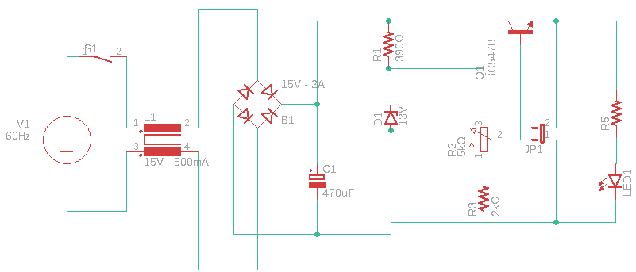

# SSC0180_2020_Fonte_Tensao
Projeto de estudo e desenvolvimento de uma fonte elétrica na matéria de SSC0180 USP 2020. Vamos partir da tensão da tomada (220V ou 127V) e teremos que transforma-la de 127V/220V Corrente Alternada em uma tensão adequada para alimentar nosso circuito. Isto é, de 3V-12V em Corrente Contínua.

## Diagrama da Fonte
### No Falstad

### Critérios
* Tensão ajustável entre 3V e 12V 
* Corrente de 100mA
* Baixo Custo

### Componentes e seus Valores
| Componente        | Especificações      | Valor (Unidade)|
| :---              |     :---:           |          :---  |
| Resistor          | 120Ω                | [R$0,86](https://tinyurl.com/y8pryj5b)         |
| Resistor          | 390Ω                | [R$0,30](https://produto.mercadolivre.com.br/MLB-1008875897-kit-100un-resistores-2w-de-potncia-escolha-1-valor-ohmico-_JM?quantity=1&variation=24614777985#reco_item_pos=0&reco_backend=machinalis-seller-items-pdp&reco_backend_type=low_level&reco_client=vip-seller_items-above&reco_id=10f4f528-f90c-4ae4-a79b-d7bc075436cd)         |
| Resistor          | 1kΩ                 | [R$0,13](https://produto.mercadolivre.com.br/MLB-1399314776-resistor-1k-ohms-100-unidades-_JM?quantity=1#position=1&type=item&tracking_id=52f519e5-730a-499f-b8c5-b95d75cb7d62)         |
| Resistor          | 2kΩ                 | [R$0,16](https://produto.mercadolivre.com.br/MLB-1359755617-100un-resistor-18w-2k-2000-ohms-_JM?quantity=1#position=1&type=item&tracking_id=cfe0aced-991b-46f7-ad48-868c569c5428)         |
| Potenciômetro     | 5kΩ                 | [R$1,09](https://www.baudaeletronica.com.br/potenciometro-linear-de-5k-5000.html)         |
| Capacitor         | 470μF               | [R$1,70](https://produto.mercadolivre.com.br/MLB-845022301-10x-capacitor-eletrolitico-470uf-x-25v-470-uf-470uf-b-_JM?matt_tool=79246729&matt_word&gclid=CjwKCAjw_LL2BRAkEiwAv2Y3Sb3K7a3Tunb33Op9IqjhFXaI9mM8M3F670_AOoe76uXUgjvsgv6zNBoC-swQAvD_BwE&quantity=1)         |
| Transistor        | 15V  e 500mA        | [R$1,12](https://produto.mercadolivre.com.br/MLB-939476869-10x-transistor-2sa1015-a1015-_JM?quantity=1&shippingOptionId=undefined)         |
| Diodo de Zener    | 0,5W                | [R$0,21](https://produto.mercadolivre.com.br/MLB-1395521239-diodo-zener-13v-05w-1n5243-lote-de-100-pecas-_JM?quantity=1#position=1&type=item&tracking_id=d4d209e7-f5b5-459a-9025-ddfa3d9fc5e1)         |
| Ponte Retificadora| 1000V e 2A          | [R$1,96](https://produto.mercadolivre.com.br/MLB-1151520283-ponte-retificadora-2w10-2a-1000v-lote-com-10-pecas-_JM?quantity=1#position=25&type=item&tracking_id=595601ca-7ab7-4d81-a34e-d3e6fc7ebbfb)         |
| Transformador     | 15V e 500mA         | [R$25,90](https://www.filipeflop.com/produto/transformador-trafo-15v-500ma-bivolt/)         |
|LED                | Difuso 3mm          | [R$0,20](https://www.eletrogate.com/led-difuso-3mm-vermelho)    |
|Switch             | 250V e 3A           | [R$8,00](https://tinyurl.com/y9v33gzg)    |
| **Custo Total**   |                     | **R$41,63**        |          
<!-- | Fios (jumper)     | 15V e 500mA         | R$            | -->
<!-- | Protoboard        | 830 Pontos          | R$            | -->
### Justificativa dos Componentes Escolhidos
1. Resistores
    * R1 (390Ω) : Limita corrente eletrica que passa pelo Zener  
    * R2 (5kΩ)  : Potenciômetro , regula a corrente de base que vai para o transistor, assim a fonte varia de 12v e 100mA para 3v e ~24mA
    * R3 (2kΩ)  : Como está ligado em série com o potênciometro ele também serve para regular a tensão de base que vai para o transistor e consequentemente a voltagem de saída de nossa fonte.
    * R4 (120Ω) : Auxiliar para a regulagem da tensão de saída (é como a saída da fonte). Representa a saída da Fonte no pior caso (120ohms)
    * R5 (1kΩ)  : Deixa a corrente adequada para o funcionamento do LED
2. Capacitor
    * Serve para estabilizar a tensão do circuito
    * Nosso circuito chega em um pico de 15V, então o de 25V é mais do que suficiente.
3. Transistor
    * Atenua a corrente e a tensão que vai para a saída do sistema através da corrente de base de 1mA que passa pelo potenciometro R2 e a resistência R3.
4.  Diodo de Zener
    * Equivale a : 13V e 20mA. Isso pois (P=i*U) P = 13V * 0,02A = 0.26W, então um diodo de 0,5W é mais do que suficiente
    * É importante ressaltar que: a corrente que passa pelo diodo é a corrente que atravessa o resistor 390 Ohm (R1: 6mA ) menos 3mA que vai pro transistor ==> 3mA passando no Zener
    * Como opera inversamente, ele mantem o valor da tensão máxima, no caso os 13V.
5. Ponte Retificadora
    * Transforma AC em DC que sai de nosso transformador
6. Transformador
    * 127V ou 220V através de chave seletora no circuito. Potência de 7,5W
7. LED
    * Indica que o circuito está ligada, algo trivial
<!-- 8. GND
    - O ground faz o escape da energia para um local seguro, por precaução -->
<!-- 8. Fios
    - Conectam os componentes do circuito  -->
<!-- 9. Protoboard
    - Base de construção de circuitos. Escolhida por praticidade, não necessita soldar para conectar componentes do circuito -->

## Circuito no Falstad
* http://tinyurl.com/yb2yxa53

## Projeto do Esquemático e do PCB no EAGLE
### Esquemático
O projeto esquemático é análogo a uma "planta" de um circuito. Nele são ilustrados os componentes, valores e suas conexões no circuito. 

### PBC ( _Printed Circuit Board_ )
O PCB é uma placa dedicada a expressar as conexões de um determinado circuito. Permitem uma instalação precisa, compacta e confiável dos componentes.  
 
OBS: os arquivos pertinentes ao projeto realizado no EAGLE podem ser encontrados neste mesmo repositório, na pasta "eagle"

## Fotos do Circuito (EM BREVE)
` incluir fotos da placa/protoboard`

## Vídeo Explicativo

## Participantes

* **Giovanni Shibaki Camargo** - [giovanni-shibaki](https://github.com/giovanni-shibaki)

* **Melissa Motoki Nogueira**  - [mmotokki](https://github.com/mmotokki)

* **Pedro Kenzo Muramatsu Carmo** - [Muramatsu2602](https://github.com/Muramatsu2602)

## Agradecimentos

* Agradecimentos ao [Prof Simões](https://github.com/simoesusp) pela oportunidade de realizar o projeto.
* Agradecimentos à equipe pela dedicação e afinco nestes tempos anômalos
* Special thanks to [Mehdi Sadaghdar](https://www.youtube.com/watch?v=j4u8fl31sgQ&list=PLr_CZLgMkHeXc_45uIgYutY0m6fqmI5du), whose insighful videos made learning electronics more enjoyable!

## Observações

* O circuito montado no Falstad e no Eagle são baseados em um transformador de 127V. Caso 220V fosse utilizado algumas possíveis mudanças poderiam ser necessarias, podendo ser utilizado um Capacitor de 1000uF.
* O embasamento teórico para a elaboração da fonte pode ser encontrada no [livro](https://www.amazon.com.br/Eletr%C3%B4nica-B%C3%A1sica-Computa%C3%A7%C3%A3o-Annibal-Junior/dp/8521616996) base da disciplina
